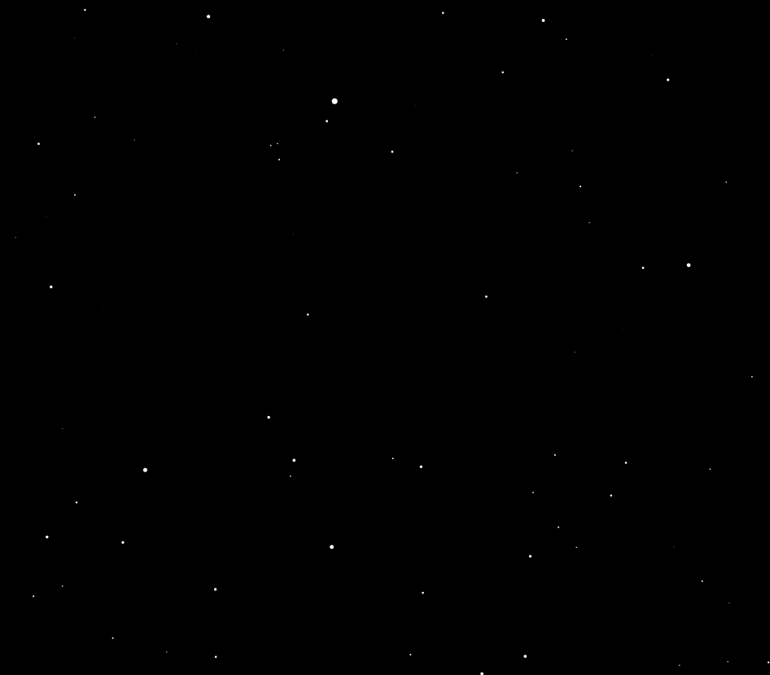
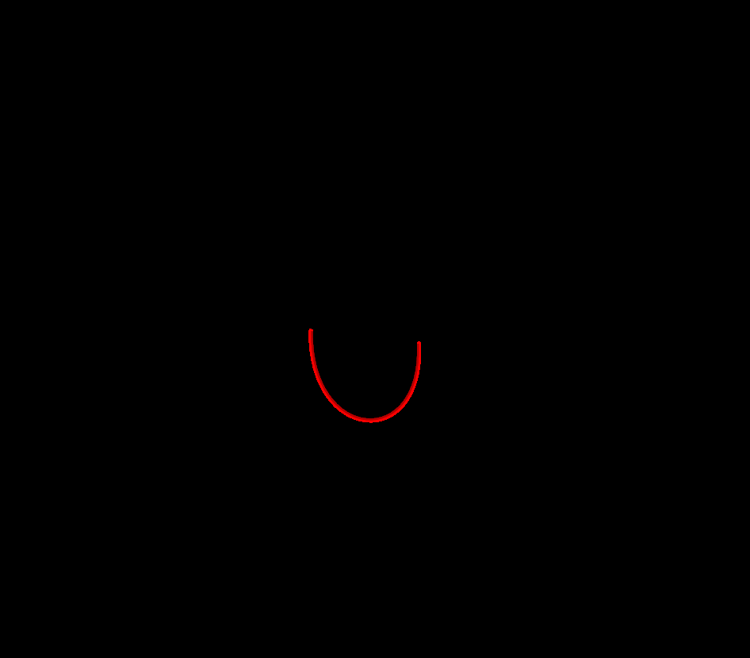

<h1>🕳 P5.JS - PROCESSING LIBRARY 〽</h1>

<b>P5.JS Library Personal Playground</b>

<a href="https://p5js.org/es/">P5.JS</a> is a JS client-side library for creating graphics and interactive experiences, based on the core principles of <a href"https://processing.org/">Processing</a> for today’s web using <b>WEBGL</b>

<i>Terrain Generator - <a href="https://editor.p5js.org/danielplata79/sketches/WntJFe0MS">SOURCE CODE 💾</a></i>

<i>Celullar Grid - <a href="https://editor.p5js.org/danielplata79/sketches/KDWWvLPl8">SOURCEC CODE 💾</a></i>

<i>StarChase - <a href="https://editor.p5js.org/danielplata79/sketches/AiAieuYII">SOURCE CODE 💾</a></i>

<i>Animated Bezier Flow - <a href="https://editor.p5js.org/danielplata79/sketches/UUTR1OfsN">SOURCE CODE 💾</a></i>

<i>Vector Noise Field - <a href="https://editor.p5js.org/danielplata79/sketches/LijOFspN4">SOURCE CODE 💾</a></i>
